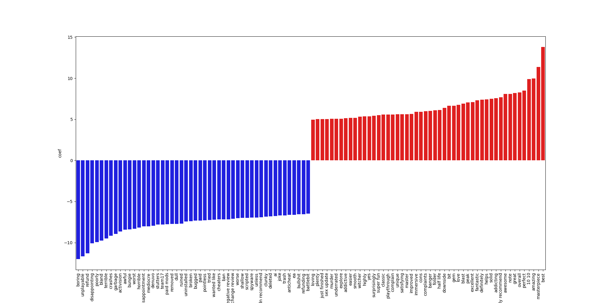
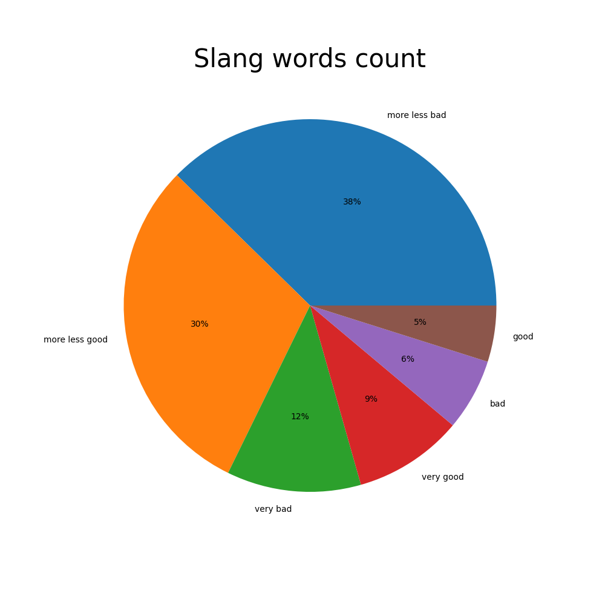
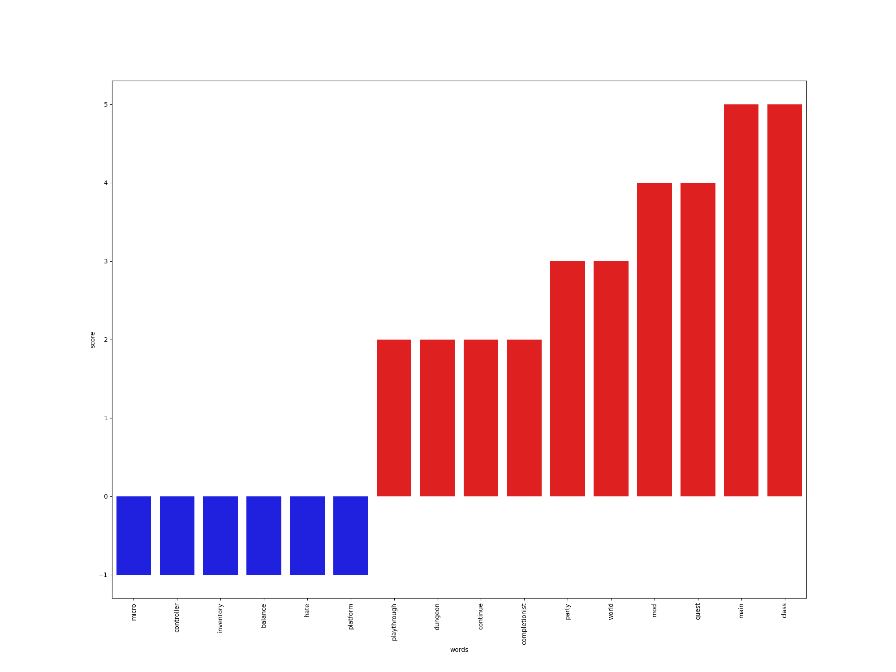
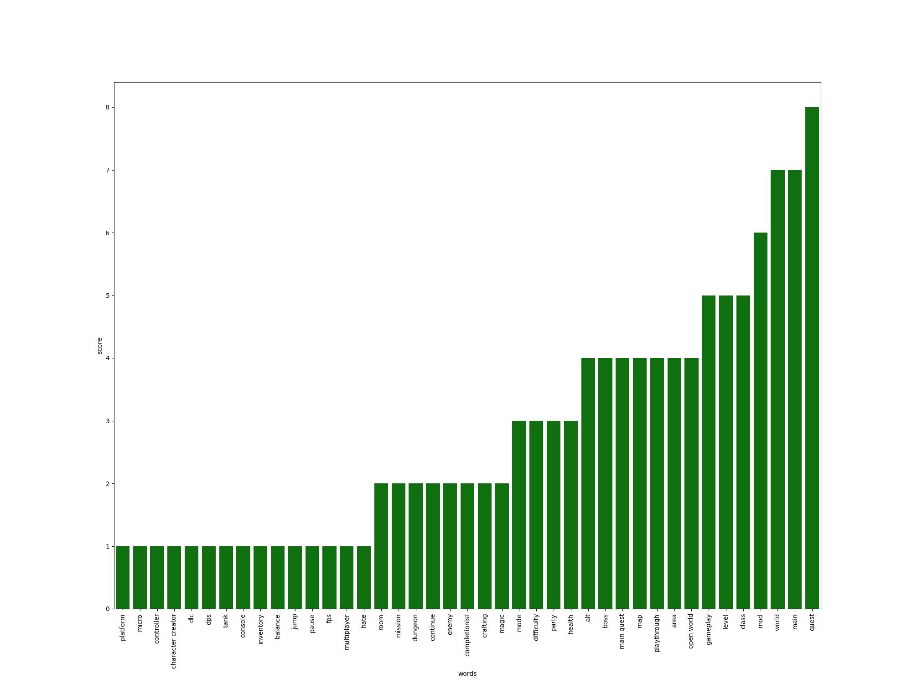

# Steam Reviews Analyzer using Slang video game words

## Libraries
The following project was created using the following libraries:
- requests
- selenium
- webdriver (imported from selenium)
- ChromeOptions (imported from selenium.webdriver)
- By (imported from selenium.webdriver.common.by)
- json
- bs4.BeautifulSoup
- pandas
- sklearn (includes TfidfVectorizer, make_pipeline, LogisticRegression, GridSearchCV)
- numpy
- matplotlib.pyplot
- seaborn

## Problem: 

Reviews are key whenever data about something is needed in order to make a decision about a product, specially when it is provided by someone that had used the product before.
In a review we expect to see good and bad traits of a product that we can find useful in order to make a decision about buying the product.
In the ecosystem of videogames, the reviews exist, but they are somehow different of the reviews of regular products.
By far most of the top upvoted reviews usually correspond to funny reviews and love/hate to the game but not necessarily have the most useful information about the game. Sometimes very upvoted reviews just are sentences that are not related to de videogame at all. Yet some very descriptive and useful reviews are shadowed and never seen because not much people is willing to scroll down hundreds of reviews about a game.

## Objectives : 

The aim of the present work is to extract useful information from the reviews. For this purpose, Steam reviews are used. For many particular videogame cases these are counted by hundreds so using steam will allow us to build a very big database of reviews. 
The main idea is to train a ML algorithm that is based in sentiment analysis that could be able to predict how recommendable a game is based on a set of reviews found in steam for that game. Also, the idea is to highlight key terms both from a dictionary of videogame slang or provided by the user that are labeled as a good or bad trait in the videogame.

## Methodology: 

In steam Each videogame title is paired with a Steam ID that identifies the game. Using this IDs the reviews can be searched.
Several functions are built to perform this task.

1.	A function will be used to scrape steam IDs from a Steam web pages
2.	For each review n reviews are downloaded and stored in a csv file. The reviews are provided by the Steamworks API. Each review has a thumbs up or thumbs down reflecting if the user of the review would recommend the game or not.
3.	The reviews will be processed and analyzed using TF-IDF. This process will find relevant terms found in the corpus of documents and will give them a score; this way the former is associated to each word found relevant.
4.	A binary classification model is trained. The model is going to be used to predict if a review would recommend or not the game.
5.	To analyze a videogame then the following steps will be performed:
    -	Download m reviews of the videogame
    -	Using the trained model a TF-IDF + prediction is performed
    -	Based on the prediction a score is given
    -	An analysis of the game slang words found in the documents is performed

## Results

Below we have te top 50 words related to negative reviews (blue) and positive reviews (red) found in the trained model

Below is the general distribution of the slang words found in the reviews classified in

- Very bad
- bad
- mostly bad
- mostly good
- good
- very good

This means that each word was found to be related to that kind of review.

### Particular game analysis

- Game: Dragon Age Inquisition. ID = 1222690

The figure below shows slang terms found in the game review and their asociation with negative and positive reviews

The figure below shows the number of occurance of each slang word fond in the reviews

### Relevant Reviews

Using the information above is possible to get relevant reviews that used a lot of videogame slang words. This will provide the most informative reviews

### Score 

The ML model can give us an score (positive score) that thell us how positively valued think the game is. Here is an example of a few games analyzed and compared with the steam results

<table border="1" class="dataframe">
  <thead>
    <tr style="text-align: right;">
      <th></th>
      <th>name</th>
      <th>prediction</th>
      <th>steam_results</th>
      <th>recent</th>
    </tr>
  </thead>
  <tbody>
    <tr>
      <th>0</th>
      <td>Lost Ark</td>
      <td>28.6</td>
      <td>mostly positive</td>
      <td>varied</td>
    </tr>
    <tr>
      <th>1</th>
      <td>DRAGON BALL FighterZ</td>
      <td>93.0</td>
      <td>very postive</td>
      <td>very postive</td>
    </tr>
    <tr>
      <th>2</th>
      <td>None</td>
      <td>73.2</td>
      <td>very postive</td>
      <td>very postive</td>
    </tr>
    <tr>
      <th>3</th>
      <td>Hades</td>
      <td>98.2</td>
      <td>extremely positive</td>
      <td>extremely positive</td>
    </tr>
    <tr>
      <th>4</th>
      <td>Darksiders III</td>
      <td>75.4</td>
      <td>mostly positive</td>
      <td>mostly positive</td>
    </tr>
    <tr>
      <th>5</th>
      <td>Apex Legends</td>
      <td>69.6</td>
      <td>mostly positive</td>
      <td>varied</td>
    </tr>
  </tbody>
</table>

# Conclussion

- Reviews given by the comunity are very useful for determinig if a game is good or bad, but the interaction of the people with the reviews, making a review more determinant than others sometimes is related with the humor of the video game comunity. The scores and related information provided by steam for the reviews not always help to find if a reviw is good or bad regarding the appreciation of a game. An algorythim provided by sentiment analysis could help to identy the key terms that tell if a game is good or bad based both in the comunity an personal interests of a player.

- Identify game slang words in the reviews could help improve the users quest to find if a game is wether good or bad. Presented in order of relevance could help a buyer to look for personal interests regarding the enjoyement of a particular game. 
